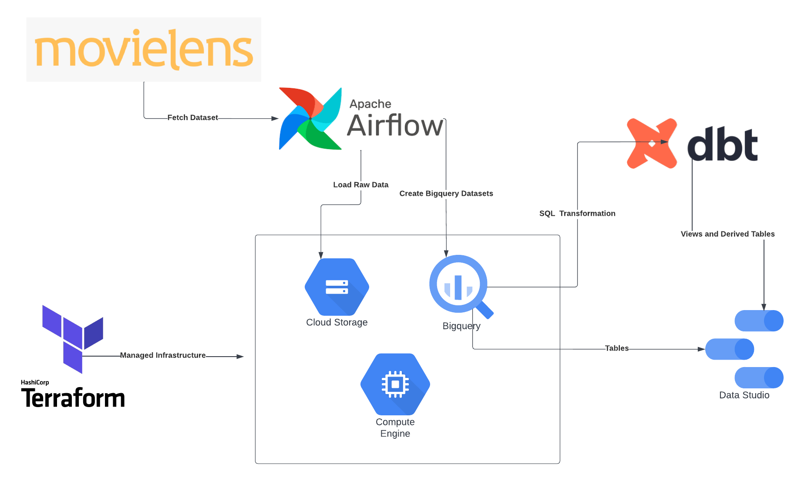
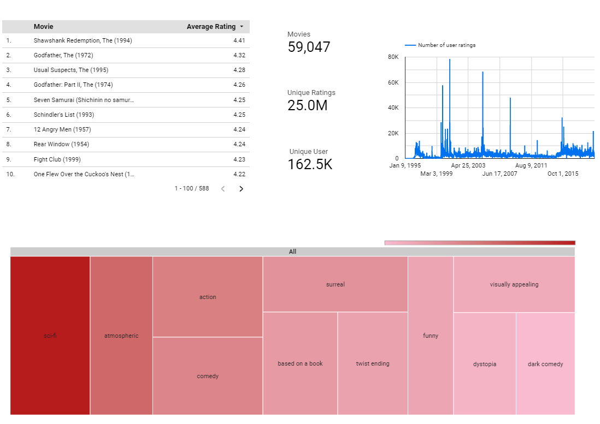

# ETL Pipeline on Movielens-25m Dataset

# Overview

This project demonstrates an ETL pipeline using modern data engineering tools and platforms which can be applied on any dataset

# Dataset

The chosen dataset for this project is the [Movielens-25m](https://grouplens.org/datasets/movielens/25m/). 25 million ratings and one million tag applications applied to 62,000 movies by 162,000 users.

# Architecture

1. Cloud resources are initialized using terraform
2. An Airflow workflow ingests the  data from the movielens website into the cloud
3. The datasets are uploaded to the cloud as raw data (parquet format) into the data lake and as tables in BigQuery for processing
4. A simple SQL transformation is applied using dbt on the ratings table by clustering on the movieId column, this will allow reduction of query time from 8-10 seconds to under 1 second 
5. All data sources are then connected to Data Studio for visualization 

# Tools and Platforms

This project makes extensive use of the Google Cloud Platform:

- Compute Engine: VM for development
- Bigquery: data warehouse
- Cloud Storage: data lake and raw data storage
- Data Studio: dashboard and visualization

Other tools used for the project

- Terraform: Infrastructure-as-code (IAC)
- Airflow: Workflow orchestraction
- Docker: Containerization
- Data Build Tool (DBT): SQL transformations

# Dashboard

You may access the dashboard with the visualizations [in this link](https://datastudio.google.com/reporting/74fc2097-c00b-4e25-ad16-fda5aefa0c53).

# Acknowledgement

This project was done as a direct application on the material provided by the great folks at  [The Data Engineering Zoomcamp](https://github.com/DataTalksClub/data-engineering-zoomcamp).